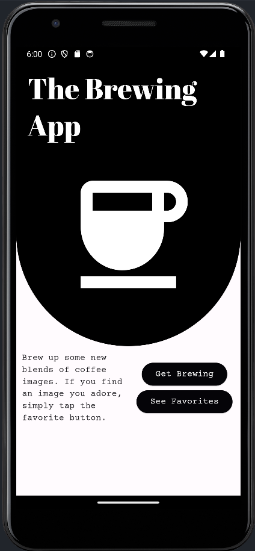
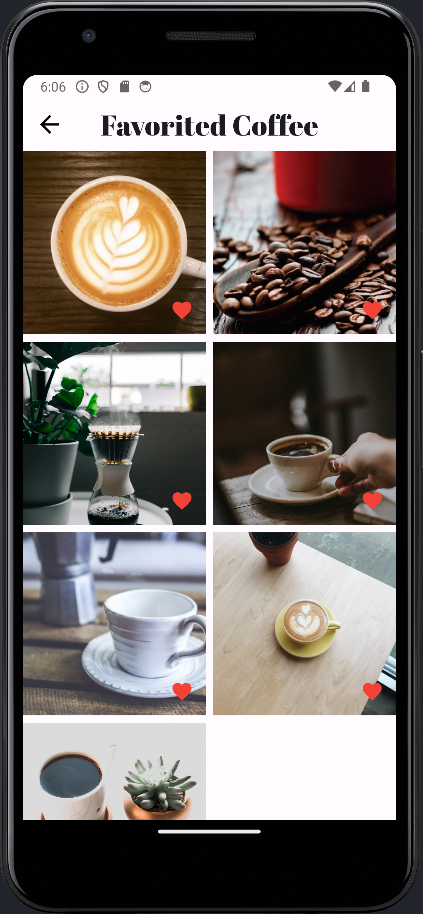

# Coffee App

Coffee App is an app for coffee enthusiasts who appreciate a good-looking brew. This app curates a
collections of coffee images that you can explore, favorite, and enjoy at your leisure.

## Installation Guide

Dart Version: ^3.3.4

Flutter Version: ^3.19.6

Installing dependencies: Run the following commands to install dependencies and run the app.

```bash
flutter pub get
flutter run
```

### Tests

To run the tests:

- **Generate Golden Files**: To generate golden files for the first time, run the following command.

```bash
flutter test --update-goldens
```

- **Review Generated Goldens**: After running this command, navigate to
  '**test/brewing_screen/goldens**' and '**test/favorited_coffee_screen/goldens**'
- **Run Tests**: For subsequent test runs without modifying goldens, run the following command.
```bash
flutter test
```
## API Usage
To application pulls coffee images from AlexFlipNote's free Coffee API. 

The application interacts with the following endpoint of the API:
- **'https://coffee.alexflipnote.dev/random.json'**
  - Returns a URL for a randomly generated coffee image.

For more documentation on the API: https://coffee.alexflipnote.dev

## Features

### Menu Page

- Navigate to the area of the app you desire the most; See your favorite or brew some more coffee
  images.

### Brewing Some Coffee

- Don't like what you see? Tap "Brew Some Coffee" to generate a new random coffee image.
- Really like what you see? Tap that heart icon! (Make a mistake? Tap it again).

### Favorites

- Access you favorite images anytime, on or offline!
- Decide you don't like it? Remove by tapping the heart icon in the corner of the image.

  

